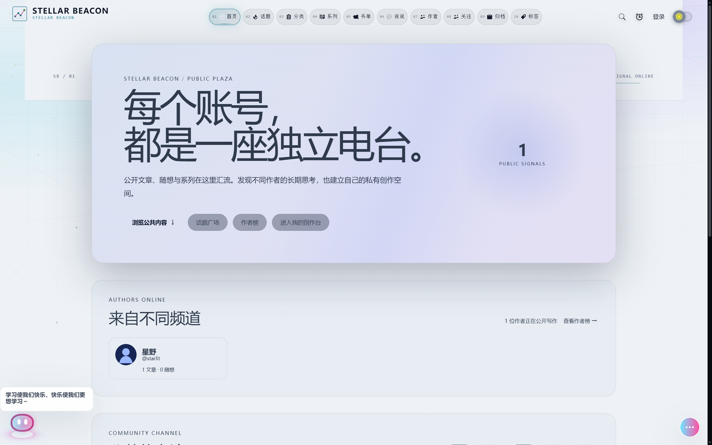
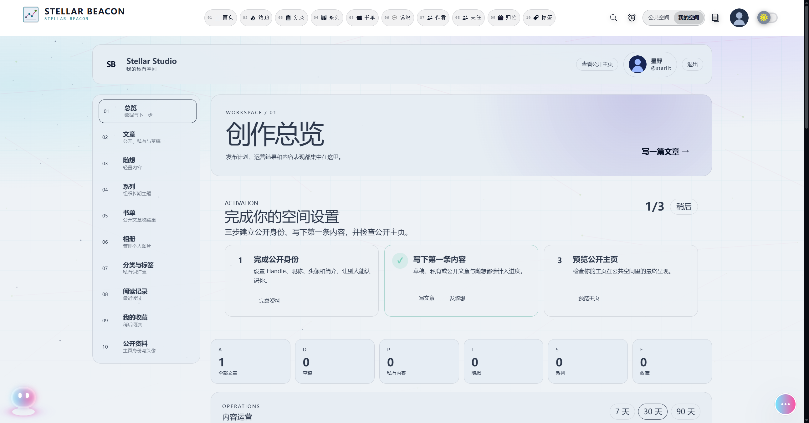
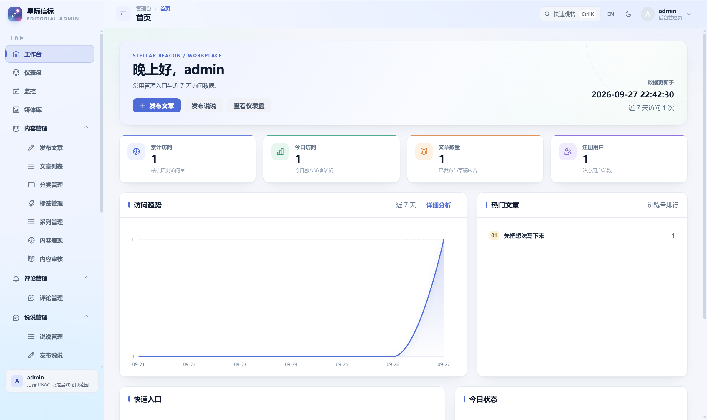
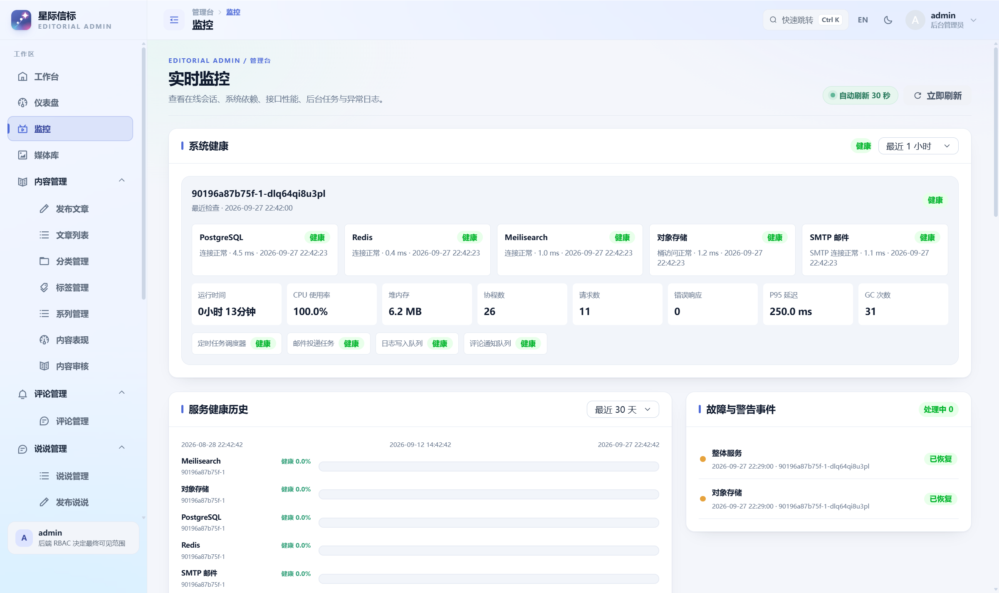

# 星际信标 · Stellar Beacon

星际信标是一套多作者博客系统。访客可以浏览文章、随想、话题和作者主页；作者在个人创作空间管理内容；管理员通过管理台处理审核、用户和站点运行情况。

## 页面展示

### 博客前台





### 管理台





截图使用虚构演示数据。

## 技术栈

- 后端：Go、PostgreSQL、Redis、Meilisearch
- 前台与管理台：Vue 3、Vite；管理台使用 Pinia 和 Arco Design
- 部署：Docker Compose、Caddy；对象存储可选 MinIO 或阿里云 OSS

## 快速部署

以下步骤用于一台全新的 Linux x86_64 主机。需要 Docker Engine、Docker Compose v2、已指向主机的站点域名和管理端子域名。防火墙开放 TCP 80/443；使用 HTTP/3 时也开放 UDP 443。Caddy 会自动申请 HTTPS 证书。

克隆项目并准备环境文件：

```shell
git clone https://github.com/afterlune/stellar-beacon.git
cd stellar-beacon
cp .env.production.example .env.production
```

编辑 `.env.production`：填写 `SITE_DOMAIN`、`ADMIN_DOMAIN`、`ACME_EMAIL`、SMTP 配置和对象存储公开地址；将所有 `replace-with-...` 换成独立的强密码。`.env.production` 含部署凭据，不要提交到 Git。

默认使用 Compose 内的 MinIO。启动后会先运行数据库迁移，再启动 API、博客、管理台和 Caddy：

```shell
docker compose --env-file .env.production -f deploy/compose/production-standalone.yaml --profile minio up -d --build
```

首次部署后创建管理员。命令会在终端中安全读取并确认密码：

```shell
docker compose --env-file .env.production -f deploy/compose/production-standalone.yaml --profile minio exec -it backend /app/stellar-beacon bootstrap-admin --email admin@example.com
```

随后访问 `https://<SITE_DOMAIN>` 和 `https://<ADMIN_DOMAIN>`。新栈从空白站点开始，不会导入仓库里的历史数据库或文章。若改用阿里云 OSS，按[部署手册](docs/runbooks/deployment.md)填写存储配置，并在 Compose 命令中省略 `--profile minio`。

查看日志、更新和停机：

```shell
docker compose --env-file .env.production -f deploy/compose/production-standalone.yaml --profile minio logs -f --tail=100
docker compose --env-file .env.production -f deploy/compose/production-standalone.yaml --profile minio up -d --build
docker compose --env-file .env.production -f deploy/compose/production-standalone.yaml --profile minio down
```

`down` 会保留数据库和对象存储卷。不要在常规更新时加 `-v`。备份、恢复和现有 Windows 生产栈说明见[部署手册](docs/runbooks/deployment.md)。

## 本地开发

前端安装、构建和开发服务器说明见 [`web/README.md`](web/README.md)。隔离联调步骤见[联调手册](docs/runbooks/deployment.md#隔离联调)。

API 路由以 `/api/v1` 为前缀，接口定义见 [`docs/api/openapi.yaml`](docs/api/openapi.yaml)。文档索引见 [`docs/README.md`](docs/README.md)。

## 目录

- `cmd/`：服务和管理命令
- `internal/`：领域、应用服务、HTTP 接口和基础设施适配器
- `deploy/`：Compose、Caddy、运行配置和数据库脚本
- `web/apps/`：博客前台与管理台
- `web/packages/`：前端共享 API 契约和请求客户端
- `docs/`：接口、部署手册、设计说明和架构决策
